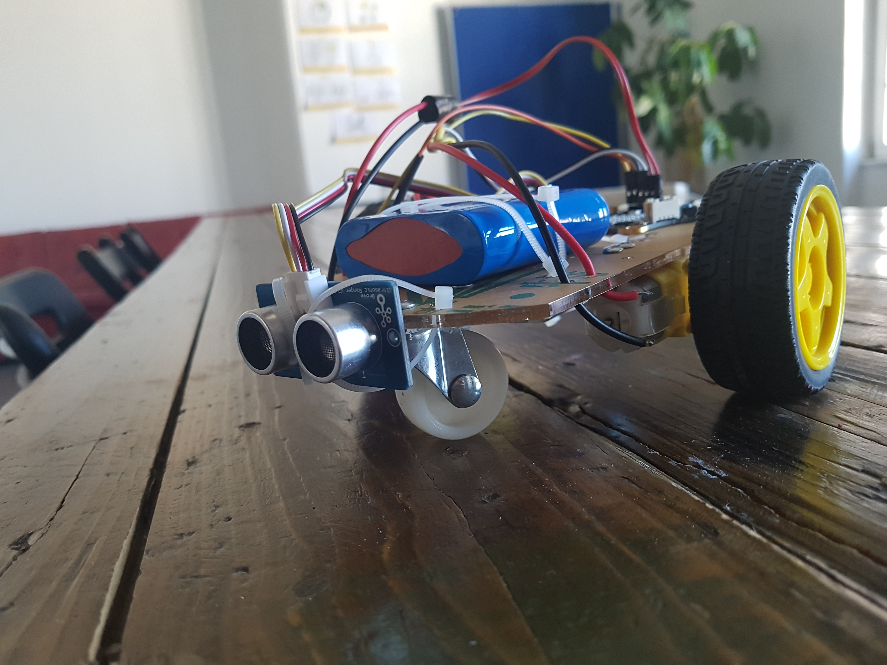

# calliope-car

Wir bauen ein mit calliope gesteurtes Auto was einerseitz durch die Neigung eines Calliope in die Gewünschte 
richtung fährt und andererseitz auch alleine fahren kann...

(img calliope)

Das alles habe ich in meinem Praktikum bei [ubirch](https://ubirch.de) bewerstelligt 
und dazu nochmal großes danke 

#### 
* [Hardware](https://github.com/Mcccake/calliope-car/blob/master/Hardware.md) / 
* [Die Motor Programmirung ](https://github.com/Mcccake/calliope-car/blob/master/motor.md) / 
* [Fernsteuerung](https://github.com/Mcccake/calliope-car/blob/master/src/Fernsteuerung.md)
                                                                                  ˆ