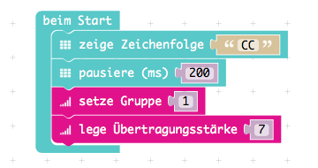
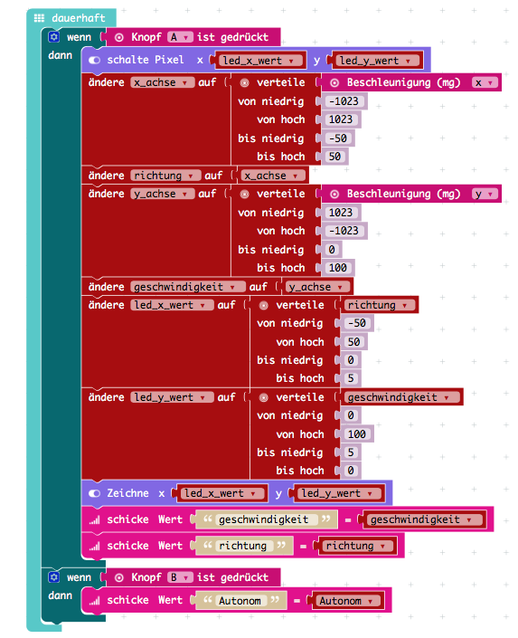
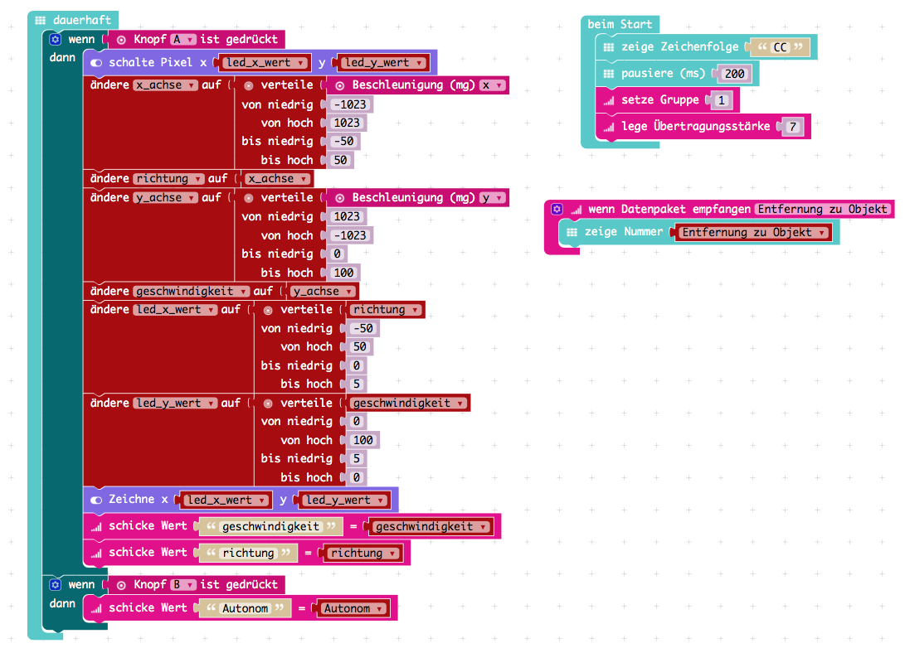

## Die Programmirung der Fernsteuerung

Als aller erstes brauchen wir den [Editor](https://makecode.calliope.cc) und dann kann es auch schon los gehen.

Der nächste schritt ist genauso wie im bei der Motor Calliope beim start zu kucken ob er an ist indem man 2 Buchstaben 
zeigt, danach wird eine Funk verbindung zur andern Calliope hergestellt 

      

Um daten zu senden müssen wir selber erst durch eingaben wie z.b taste A empfangen um sie dann zum Motorcalliope zu
schicken.

und jetzt nochmal alles zusammengestzt:

## [die Motor Programmirung](https://github.com/Mcccake/calliope-car/blob/master/doc/motor.md)
