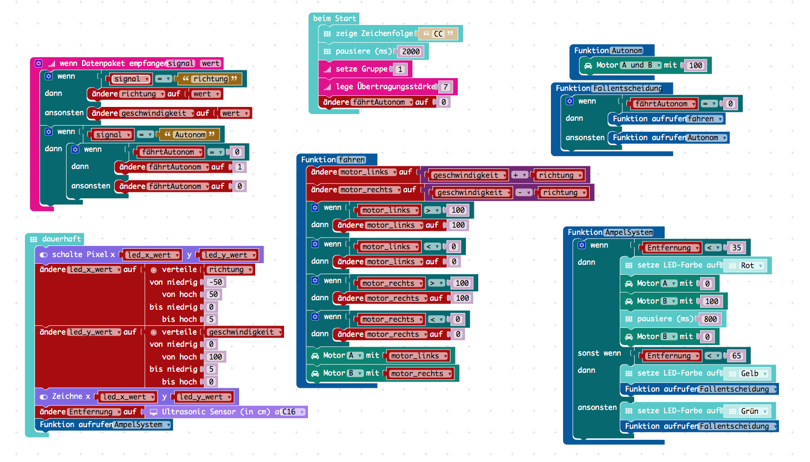

#Lösung Motor

#####Die lösung der Knobel Aufgabe:

 ##Das Gesampt Packet

 #####einfach kopieren und in das jave terminal von make code eintippen/einfügen

let geschwindigkeit = 0
let y_achse = 0
let Autonom = 0
let richtung = 0
let x_achse = 0
let led_y_wert = 0
let led_x_wert = 0
let Entfernung_zu_Objekt = 0
radio.onDataPacketReceived( ({ receivedNumber: Entfernung_zu_Objekt }) =>  {
    basic.showNumber(Entfernung_zu_Objekt)
})
basic.showString("CC")
radio.setGroup(1)
radio.setTransmitPower(7)
basic.forever(() => {
    if (input.buttonIsPressed(Button.A)) {
        led.unplot(led_x_wert, led_y_wert)
        x_achse = pins.map(
        input.acceleration(Dimension.X),
        -1023,
        1023,
        -50,
        50
        )
        richtung = x_achse
        y_achse = pins.map(
        input.acceleration(Dimension.Y),
        1023,
        -1023,
        0,
        100
        )
        geschwindigkeit = y_achse
        led_x_wert = pins.map(
        richtung,
        -50,
        50,
        0,
        5
        )
        led_y_wert = pins.map(
        geschwindigkeit,
        0,
        100,
        5,
        0
        )
        led.plot(led_x_wert, led_y_wert)
        radio.sendValue("geschwindigkeit", geschwindigkeit)
        radio.sendValue("richtung", richtung)
    }
    if (input.buttonIsPressed(Button.B)) {
        radio.sendValue("Autonom", Autonom)
    }
})

##Lösung Fernsteuerung

(img alles Fern)

let geschwindigkeit = 0
let y_achse = 0
let Autonom = 0
let richtung = 0
let x_achse = 0
let led_y_wert = 0
let led_x_wert = 0
let Entfernung_zu_Objekt = 0
radio.onDataPacketReceived( ({ receivedNumber: Entfernung_zu_Objekt }) =>  {
    basic.showNumber(Entfernung_zu_Objekt)
})
basic.showString("CC")
radio.setGroup(1)
radio.setTransmitPower(7)
basic.forever(() => {
    if (input.buttonIsPressed(Button.A)) {
        led.unplot(led_x_wert, led_y_wert)
        x_achse = pins.map(
        input.acceleration(Dimension.X),
        -1023,
        1023,
        -50,
        50
        )
        richtung = x_achse
        y_achse = pins.map(
        input.acceleration(Dimension.Y),
        1023,
        -1023,
        0,
        100
        )
        geschwindigkeit = y_achse
        led_x_wert = pins.map(
        richtung,
        -50,
        50,
        0,
        5
        )
        led_y_wert = pins.map(
        geschwindigkeit,
        0,
        100,
        5,
        0
        )
        led.plot(led_x_wert, led_y_wert)
        radio.sendValue("geschwindigkeit", geschwindigkeit)
        radio.sendValue("richtung", richtung)
    }
    if (input.buttonIsPressed(Button.B)) {
        radio.sendValue("Autonom", Autonom)
    }
})
