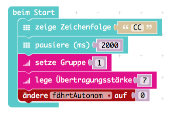
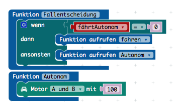
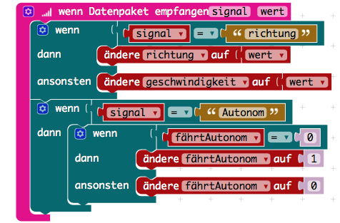

# Unsere Motorsteuerung

Damit der Calliope fährt, braucht er zum einen die Hardware und andererseits 
die Programmierung...[die Hardware ist hier zu finden](https://github.com/Mcccake/calliope-car/blob/master/doc/Hardware.md)

##
Als erstes müssen wir den Editor [makecode](https://makecode.calliope.cc) aufrufen 

Im Editor ist der erste Schritt, dass wir eine Verbindung zwischen den beiden Calliope herstellen. Also nehmen wir die 
  Bausteine "setze Übertragung" und "setzte Funkstäreke" aus dem Kasten "Funk" und packen 
  es in die Startschleife. Das machen wir in beiden Calliope-Projekten (Fernsteuerung und Motor).

 
 
Damit unser Auto später einmal autonom fahren kann, machen wir eine Funktion, die wir 
"AmpelSystem" nenen. Mit dieser Funktion wollen wir erreichen, dass das Auto nie gegen ein Hindernis fährt, 
da es ja keinen Rückwärtsgang hat (kann man auch nicht programmieren). 
In unsere Funktion packen wir ein Logik-Element, nämlich: "wenn, dann" sonst "wenn, dann", "ansonsten"...
Als erstes wollen wir gucken, ob sich ein Gegenstand vor unserem Auto befindet. Das bekommen wir hin, indem wir einen 
Messsensor an der Spitze des Fahrzeuges befestigen.

Als nächstes fügen wir unserem Start-Block 2 Elemente hinzu: 
1. eine Zeichenfolge von mindestens 2 Buchstaben und einer Pause von 2 Sekunden (2000mili)
1. eine Variable "fährtAutonom", die wir später noch brauchen werden, also fügen wir "setzte fährtAutonom auf 0" ein

Jetzt benutzen wir die Variable, aber zuerst brauchen wir eine Funktion "fallentscheidung". Diese Funktion wird sagen, ob 
wir gerade selber fahren oder ob das Auto autonom fährt. In dieser Funktion überprüfen wir das so: "wenn fährtAutonom auf 
0" ist, fahren wir selber, wenn sie auf 1 ist, fährt das Auto autonom. Dazu könen wir die Funktion "Autonom" anlegen und 
ganz einfach sagen, dass die Motoren A und B auf 100 fahren, da es ja wegen der Funktion "Ampelsystem" gegen kein Hindernis 
fahren kann.

Der allerletzte Schritt ist, dass wir ein Signal empfangen und es deuten können/müssen (selber fahren oder autonom).
Dazu müssen wir unter "Funk" den Block "Datenpaket empfangen" einsetzen. Darein packen wir 2 mal den Block "wenn, dann".
In den oberen fügen wir noch ein "ansonsten" hinzu, beim unteren nicht. Der Obere wird zum Selbersteuern benutzt, der untere
wird für das autonome Fahren gebraucht. Wenn das Signal = Autonom ist und unsere Variable "fährtAutonom" 0 ist, wird sie
auf 1 gesetzt. Wenn sie auf 1 ist wird sie auf 0 gestezt, im Klartext: Wenn man den Befehl z.B. durch drücken von B aktiviert,
wird dem Motor gesagt "Autonom", und wenn man nochmal B drückt, wird autonomes Fahren ausgeschaltet und man fährt wieder selber. 

Jetzt noch die durch Neigung gesteuerte Lenkung einfügen und das wars für den Motor-calliope.
Kleine Knobelaufgabe, da es jetzt keine Hilfe gibt für diese letzt Aufgabe (lösung ist unten ;)
#### [Nächster schritt: Fernsteuerung](https://github.com/Mcccake/calliope-car/blob/master/doc/fernsteuerung.md)
#
#### [Lösung](https://github.com/Mcccake/calliope-car/blob/master/doc/loesung.md)
